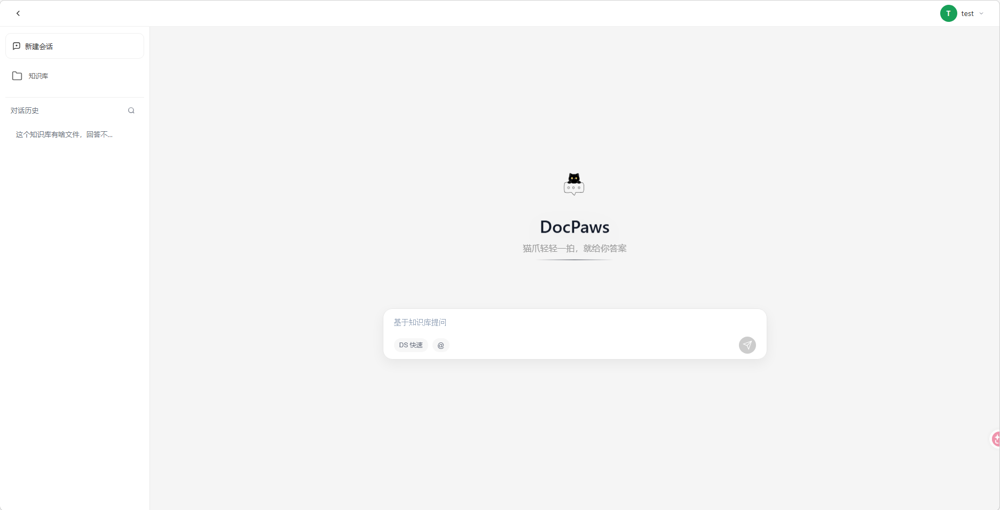
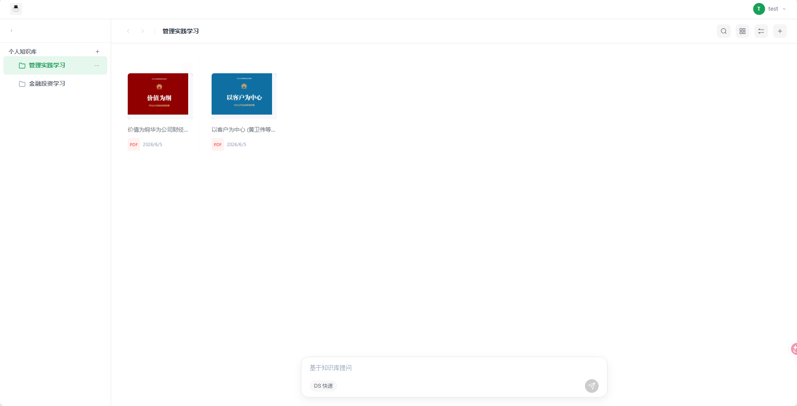
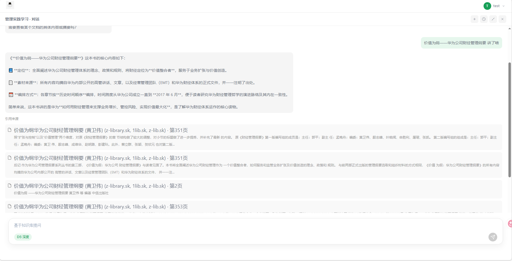
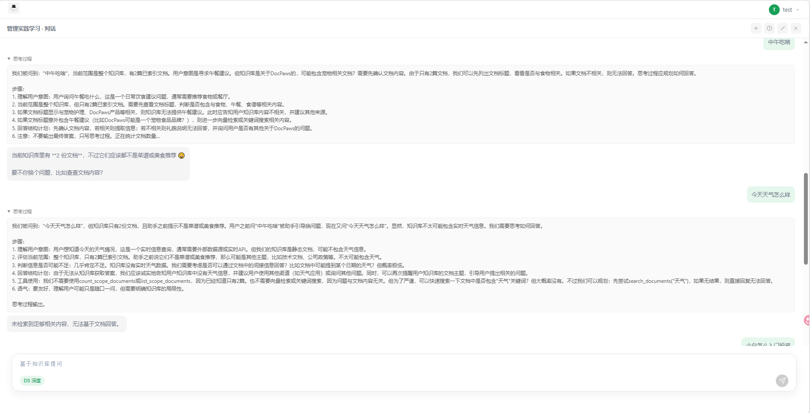

# DocPaws

企业级 RAG 文档助手：知识库管理、PDF 索引、流式对话、引用与检索阈值拒答。  
后端 FastAPI + SQLModel，前端 Vue 3 + Vite。

架构文档见 [`docs/architecture/layering.md`](docs/architecture/layering.md)、[`usecases-style.md`](docs/architecture/usecases-style.md)。  
详细后端说明见 [`backend/README.md`](backend/README.md)，评估见 [`eval/README.md`](eval/README.md)。

## 界面预览

**首页** — Welcome、会话侧栏、选知识库输入框。

<p align="center">
  
</p>

**知识库浏览** — 个人知识库、文件夹树、PDF 上传。

<p align="center">
  
</p>

**RAG 对话与引用** — 库内有答案的问题，流式回答、来源引用、scope（全库 / 文件夹 / 单文件）。

<p align="center">
  
</p>


**检索拒答** — 库外问题或距离未过阈值时拒答，避免幻觉。

<p align="center">
  
</p>

## 核心能力

- 个人知识库、文件夹、PDF 上传与 **manifest 增量索引**
- RAG 对话（**scope**：全库 / 文件夹 / 单文件）、流式 SSE、思考过程展示
- **检索距离阈值拒答**（`RETRIEVAL_MAX_DISTANCE`，详见 [`backend/README.md`](backend/README.md)）
- Golden 20 可复现评估（[`eval/`](eval/)）

## 环境要求

- [Miniconda](https://docs.conda.io/en/latest/miniconda.html) 或 Anaconda（推荐 Conda 管理后端 Python 3.11）
- Node.js 20+（前端）
- [Docker](https://docs.docker.com/get-docker/)（推荐：`docker compose up -d` 起 Redis + MinIO）
- LLM + Embedding API Key（DeepSeek / OpenAI 兼容 / SiliconFlow 等）

## 快速启动

### 0. 基础设施

在项目根目录 `DocPaws/`：

```bash
docker compose up -d
```

| 服务 | 地址 | 说明 |
|------|------|------|
| **MinIO** API | `http://127.0.0.1:9000` | 上传 PDF 对象存储 |
| **MinIO** 控制台 | `http://127.0.0.1:9001` | 账号 `minioadmin` / `minioadmin123` |
| **Redis** | `127.0.0.1:6379` | DB `/0` 缓存，`/1` Celery broker，`/2` result |

停止：`docker compose down`（数据在 Docker volume 中保留）。

### 1. 后端

在 **Anaconda Prompt** 或已 `conda init` 的终端中，于项目根目录操作：

```bash
conda create -n docpaws python=3.11 -y   # 首次
conda activate docpaws

cd backend
pip install -r requirements.txt
```

复制环境变量并填入 API Key（Windows PowerShell）：

```powershell
Copy-Item .env.example .env
```

macOS / Linux：`cp .env.example .env`。其余变量见 `.env.example` 注释。

```bash
uvicorn docpaws.main:app --reload --port 8000
```

- API 文档：<http://localhost:8000/docs>
- 本地数据默认在 `backend/data/`（SQLite、`uploads/`、FAISS 索引）

### 2. 前端

```bash
cd frontend
npm install
npm run dev
```

- 开发地址：<http://localhost:3000>
- `/api` 由 Vite 代理到 `http://127.0.0.1:8000`；改后端端口时同步改 `frontend/vite.config.js`
- `CORS_ORIGINS` 需包含前端 Origin

### 3. 可选：索引 Worker

上传 PDF 后需建向量索引。配置 `CELERY_BROKER_URL` 后，另开终端（`conda activate docpaws`，在 `backend/`）：

```bash
# Linux / macOS
celery -A docpaws.infra.tasks.celery_app:celery_app worker --loglevel=info

# Windows（需 solo 池）
celery -A docpaws.infra.tasks.celery_app:celery_app worker --loglevel=info --pool=solo
```

## 常用命令

| 目录 | 命令 | 说明 |
|------|------|------|
| `backend/` | `pytest tests/ -q` | 后端测试 |
| `frontend/` | `npm run typecheck` | Vue/TS 类型检查 |
| `frontend/` | `npm run build` | 生产构建 |
| `backend/` | `python ../eval/run_rag_eval.py` | Golden 20 评估 |

## 仓库结构

```
DocPaws/
  backend/            # FastAPI API、索引 worker、Celery 任务
  frontend/           # Vue 3 单页应用
  eval/               # Golden 20 RAG 回归评估
  docs/               # 架构约定与界面截图
  docker-compose.yml  # 本地 Redis + MinIO
```

## 许可证

本项目采用 [MIT License](LICENSE)。
