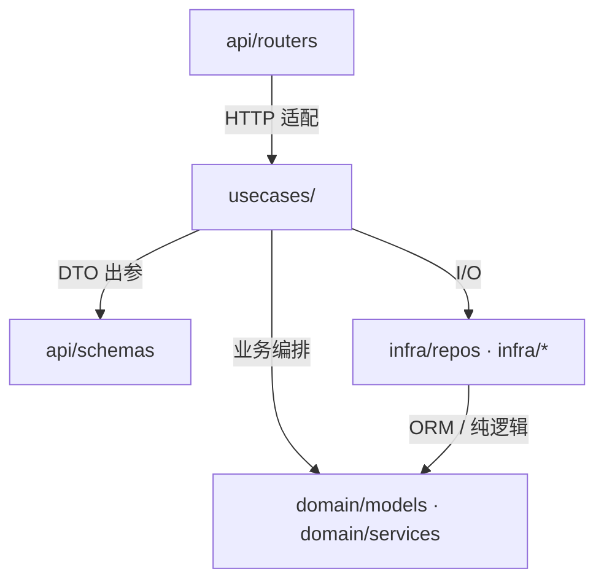

# 后端分层架构（DocPaws）

DocPaws 后端按 **api → usecases → domain / infra** 组织：HTTP 与业务编排分离，外部依赖可替换。

## 依赖方向



- **单向依赖**：上图中箭头无回边；`domain` 不 import `infra` / `usecases` / `routers`。
- **路由薄**：`routers` 不直接写 SQL/FAISS；`usecases` 不依赖 FastAPI `Request`/`Response`。
- **schemas**：与 `routers` 共用 DTO，不是 HTTP 层；序列化见 [usecases-style.md](./usecases-style.md)。
- **infra**：DB、存储、向量库、LLM、任务队列；复杂 SQL 收敛到 `infra/repos/*`。

## 各层职责

| 层 | 目录 | 做什么 | 不做什么 |
|----|------|--------|----------|
| **HTTP 适配** | `api/routers/` | 鉴权、参数校验、调 usecase、返回统一响应/SSE | 业务流程、复杂 SQL、向量检索 |
| **DTO** | `api/schemas/` | 请求/响应结构（Pydantic） | 业务规则 |
| **业务编排** | `usecases/` | 用例流程、事务边界、组合 repo/infra | 直接绑 HTTP；散落 `select(...)` |
| **领域模型** | `domain/models/` | SQLModel 表定义（按表族拆分） | HTTP、外部 I/O |
| **领域逻辑** | `domain/services/` | 无 I/O 的纯逻辑（如 manifest 增量 diff） | 访问 DB/文件 |
| **仓储** | `infra/repos/` | SQL 查询与写入封装 | 业务流程编排 |
| **基础设施** | `infra/*` | DB Session、本地/S3 存储、PDF 解析、FAISS、Embedding/LLM、Celery | 路由与 DTO |

入口与配置：`main.py` / `app.py`（装配）、`settings.py`（环境变量与部署项）、`config.py`（LLM/Embedding 默认项）。分工见 [config.md](./config.md)。

## 一次请求怎么走（以 RAG 对话为例）

```text
POST /chat/stream
  → api/routers/chat.py        校验 token、解析 body
  → usecases/chat_service.py   鉴权、scope、预检、Agent 编排、落库
  → infra/repos/*              读会话、文档元数据
  → infra/vectorstore          FAISS 检索
  → usecases/chat_agent_*      工具调用与 SSE 流
  → api 层                     SSE 推给前端
```

## 文档索引

| 文档 | 说明 |
|------|------|
| [layering.md](./layering.md) | 本文：全栈分层总览 |
| [usecases-style.md](./usecases-style.md) | usecases 层详细代码约定（DTO、AppError、文件结构） |
| [config.md](./config.md) | `settings.py` vs `config.py` 分工 |
| [backend/README.md](../../backend/README.md) | 目录树、启动、检索阈值说明 |

## 为何 usecases 单独有 style 文档？

各层都有职责边界；**usecases 改动最频繁、也最容易膨胀**（把 dict/SQL/检索全写进一个函数），因此先固化该层约定。其余层以本总览 + `backend/README.md` 中的结构说明为主；团队扩大后可再补 `api/`、`infra/` 的细规。
